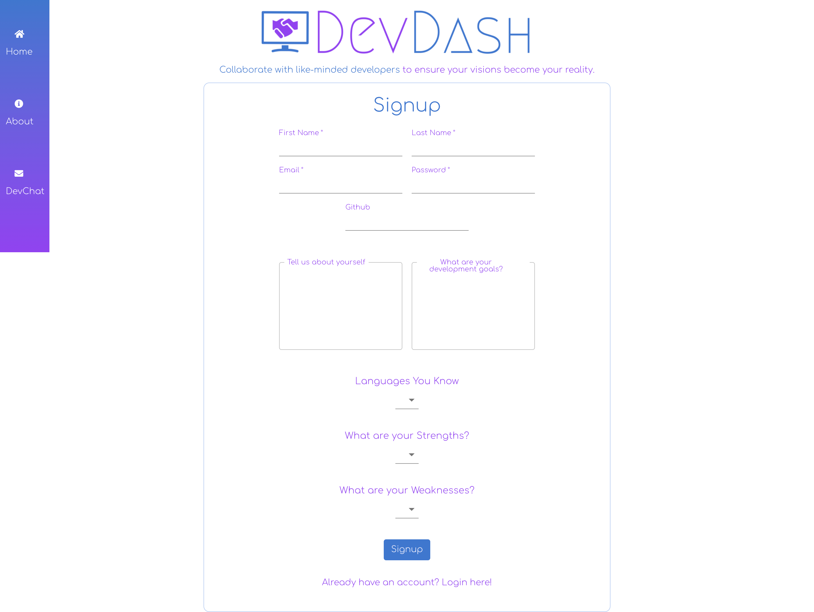
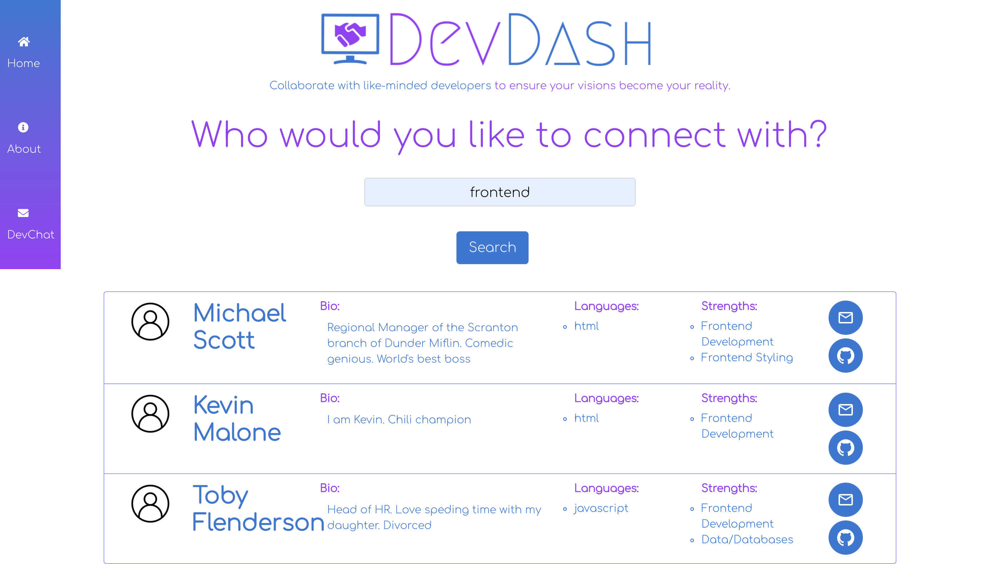
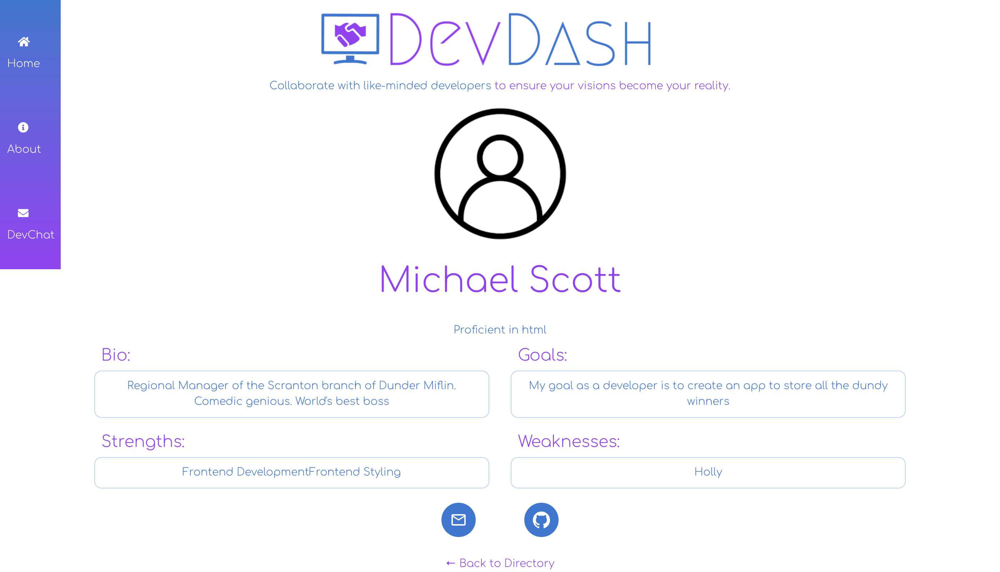
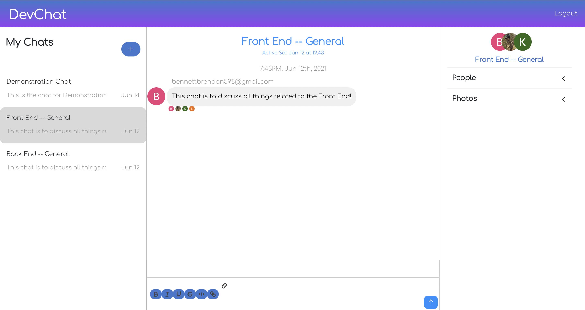

# DevDash

## Table of Contents
- [Deployed Application](#deployed-application)
- [Description](#description)
- [Badges](#badges)
- [Installation](#installation)
- [Usage](#usage)
- [Built](#built)
- [Authors](#authors)
- [License](#license)

## Deployed Application

Access the application [here](https://devdashboard.herokuapp.com/).

## Description

USER STORY: As a collaborative developer, I want to create a profile on a website where I can search for other developers filtered by a certain skill, so that I can message that developer and invite them to collaborate.

We created this application for those of us who are wanting to continue to collaborate on development projects after our bootcamp ends, even while in a pandemic. This application features a wide range of functionality, and it all starts by logging in. When you go to the website, you are taken to a signup page, where a user will input their first and last name, their email, a password, their github account (optional), a brief description of themselves, a description of their development goals, programming languages they know, as well as their strengths and weaknesses curated from a dropdown list.

Upon signup, they will be taken to a user list, where they can type in a search bar either languages another developer knows, or by their strengths. When a user(s) pop up in the display, they can view their name, their bio, the language(s) they know, their strength(s), as well as a button to email them directly or view their GitHub account on an external page. 

If the user clicks on someone's name, they will be taken to that person's profile page. There, the user can view their bio, goals, strengths, weakness, as well as email them directly on this page and/or view their GitHub profile. 

If the user hovers over the nav bar, a Chat icon slides out to display "DevChat". If the user goes to the DevChat, another layer of authentication appears on the screen, where the user will need to either login using their Google account or their Facebook account. Once logged in, they will see multiple channels on the left sidebar split into strength categories and they can choose which channels to participate in and being able to chat in real-time with other developers who are signed up and active on DevDash. From there, the user can click the "Logout" button in the upper right hand corner of the screen, where they will be taken back to the signup/login page. 

## Badges

## Installation

No installation required, however the user must have a Google or Facebook account to access the chat feature. 

## Usage

The usage of this app is limited to people who have accounts and log into them. Creating an account is easy and free and allows the user to access the features mentioned above. 

## Built With

We used [ReactJS](https://reactjs.org/) for the foundation of this application.

We used [Material UI](https://material-ui.com/), [Bootstrap](https://getbootstrap.com/), and [React Bootstrap](https://react-bootstrap.github.io/) for the layout and design elements of this application.

We used [Node](https://nodejs.org/en/) and [Express](https://expressjs.com/) for backend developement.

We used [Firebase](https://console.firebase.google.com/) and [Chat Engine](https://chatengine.io/) for the chat functionality of this application. 

## Authors

This application was written/developed by [Jeff G Cameron](https://github.com/jeffgcameron), [Brendan Bennett](https://github.com/bennettbrendan598), [Lauren Penenburgh](https://github.com/lpenenburgh), and [Kelsey Benedict](https://github.com/kelseybenedict).

## License

Copyright 2021 JeffGCameron

Licensed under the Apache License, Version 2.0 (the "License");
you may not use this file except in compliance with the License.
You may obtain a copy of the License at

http://www.apache.org/licenses/LICENSE-2.0

Unless required by applicable law or agreed to in writing, software
distributed under the License is distributed on an "AS IS" BASIS,
WITHOUT WARRANTIES OR CONDITIONS OF ANY KIND, either express or implied.
See the License for the specific language governing permissions and
limitations under the License.